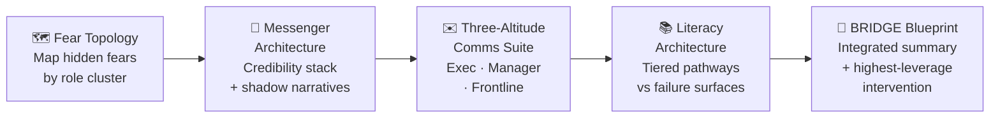

# BRIDGE Blueprint: AI Adoption Architecture

  

## Build this yourself

Everything below is a working template. Swap the bracketed values for your own context and paste the result into your chosen workspace. The example values come from a real workshop run.

```text
# BRIDGE Blueprint — AI Adoption Architecture

Organization:   [YOUR ORG]          # e.g. "Regional logistics company, 600 staff"
Initiative:     [YOUR AI INITIATIVE] # e.g. "AI route optimization for dispatch team"
Fear climate:   [YOUR RATING]        # e.g. "Smoldering (fear present but contained)"
Highest-leverage intervention: [YOUR CHOICE]
  # e.g. "Peer-messenger program: train 8 respected dispatchers as AI champions
  #        before the tool goes live, so frontline staff hear from people they trust"

Fear Topology — primary cluster:
  Role:          [YOUR ROLE CLUSTER]  # e.g. "Experienced dispatchers (10+ years)"
  Surface fear:  [SURFACE SIGNAL]     # e.g. "Complaints that the tool is unreliable"
  Intermediate:  [INTERMEDIATE FEAR]  # e.g. "Their route knowledge will be devalued"
  Deep fear:     [DEEP FEAR]          # e.g. "They will lose irreplaceable expert status"

Messenger Credibility Stack — top pick per audience:
  Frontline:     [YOUR FRONTLINE MESSENGER]   # e.g. "Senior dispatcher, 12 yrs tenure"
  Managers:      [YOUR MANAGER MESSENGER]     # e.g. "Operations supervisor who piloted tool"
  Executives:    [YOUR EXEC MESSENGER]        # e.g. "COO with P&L accountability"

Literacy tiers:
  Tier 1 (high fear):   [YOUR TIER 1 FORMAT]  # e.g. "Cohorts of 5, hands-on, peer-led"
  Tier 2 (moderate):    [YOUR TIER 2 FORMAT]  # e.g. "Workshop + job aid + manager check-in"
  Tier 3 (early adopters): [YOUR TIER 3 FORMAT] # e.g. "Self-paced + advanced use cases"
```



---

## The story behind this build

Randeep built this AI adoption architecture for **Education Pals** — a real organizational context, analyzed honestly rather than aspirationally. The work covers four interconnected layers: a Fear Topology Map that names what people are not saying, a Messenger Architecture that routes the right voices to the right audiences, a Three-Altitude Communication Suite drafted for actual delivery, and a Literacy Architecture designed explicitly against the six failure surfaces that sink most AI training programs.

The integration is the point. These are not four separate tools — they are one system, and the synthesis in Section 5 makes the connections explicit.

---

## Proof artifacts

| File | What it contains |
|------|------------------|
| [bridge-blueprint.md](./bridge-blueprint.md) | Full four-layer playbook with fear map, messenger stack, literacy architecture, and BRIDGE summary |
| [communications-suite.md](./communications-suite.md) | Three fully drafted communications ready for delivery |
| [blueprints/chat.md](./blueprints/chat.md) | Chat prompt for continuing BRIDGE analysis in any workspace |
| [blueprints/worksheet.md](./blueprints/worksheet.md) | Blank playbook template for reuse |

---

## my-build/

Put screenshots, session notes, and iteration evidence here.

---

Model-assisted draft — review before sharing.
